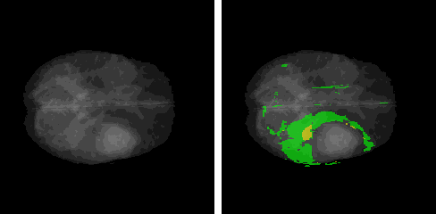
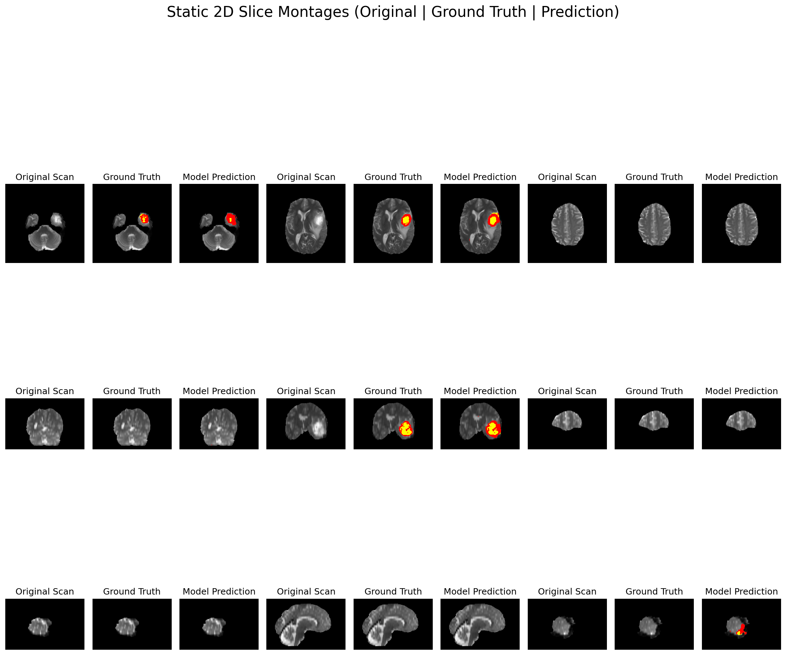
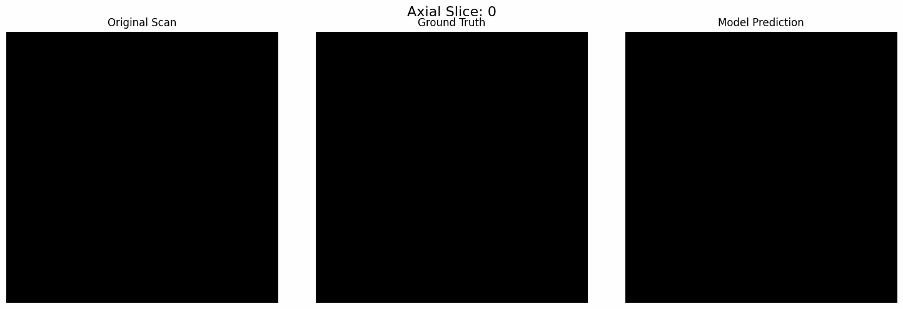
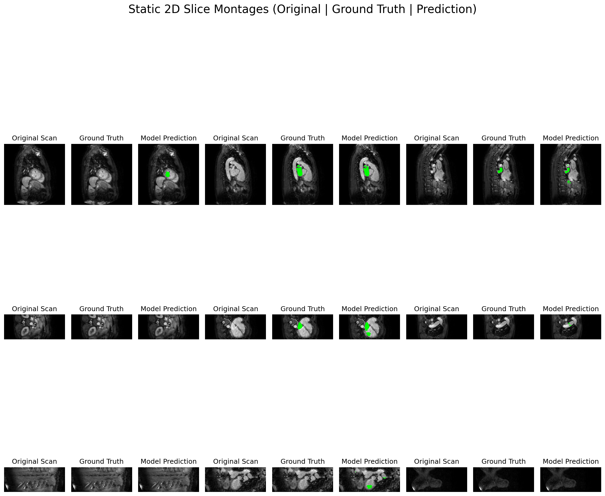
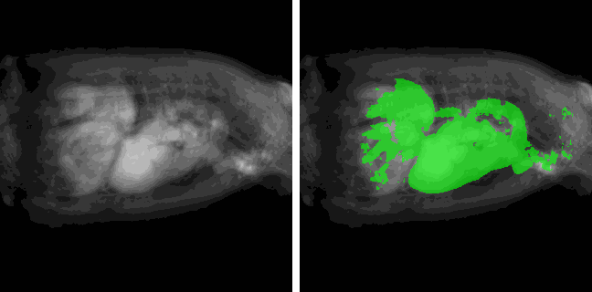
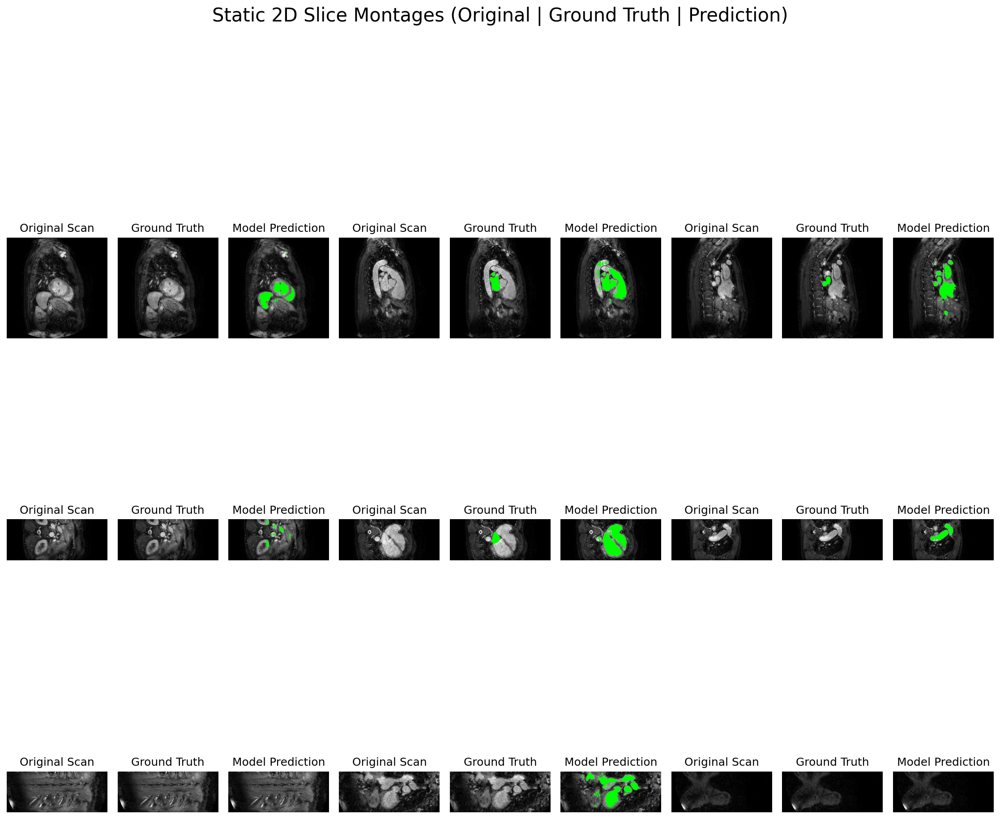
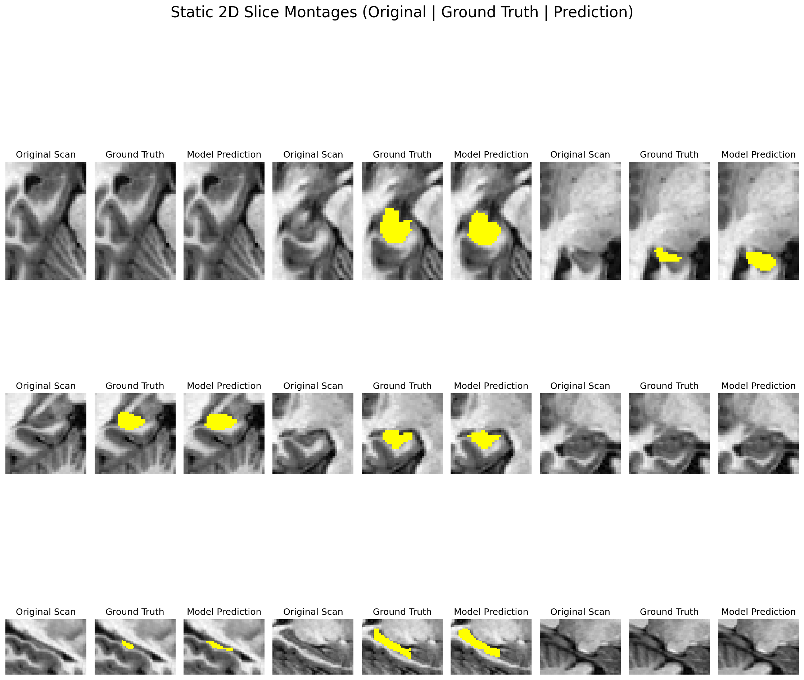
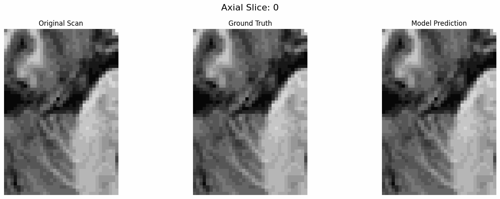
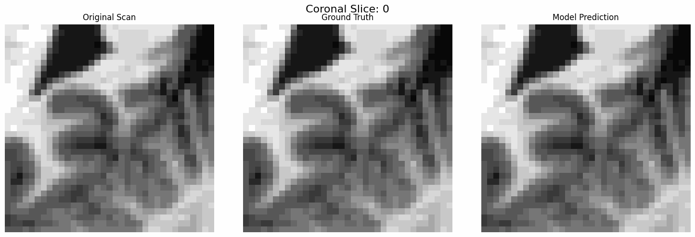
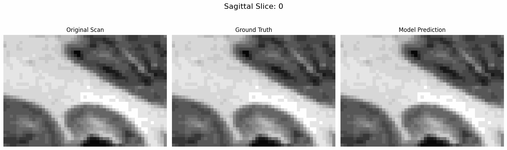

## ****3D Medical Image Segmentation with Advanced Deep Learning Architectures****

## **1. Project Overview**

 This repository contains a professional-grade, end-to-end framework for 3D medical image segmentation, built from scratch in TensorFlow and Keras. It is designed as a robust, scalable, and high-performance solution for tackling the 10 diverse challenges of the **Medical Segmentation Decathlon (MSD)**.The entire system is engineered with a **config-driven philosophy**; a single YAML file controls every aspect of the pipeline, from data ingestion and model architecture to the training curriculum and inference settings. This allows the framework to be rapidly adapted to any of the 10 MSD tasks (or other 3D datasets) with zero code changes.This project is not a simple model.fit() wrapper. It is a complete, TPU-native MLOps pipeline that includes:* **SOTA 3-Stage Data Pipeline:** A training curriculum that moves from foundational learning (foreground sampling) to refinement (rare-class oversampling) and finally to honing (Online Hard Example Mining - OHEM).

* **Modular SOTA Models:** Custom 3D implementations of UNET++ (with deep supervision), TransUNET, and SwinTransUNET.

* **Custom Distributed Training Loop:** A from-scratch training loop optimized for tf.distribute.TPUStrategy and mixed\_bfloat16 precision for maximum performance.

* **High-Fidelity Inference Engine:** A state-of-the-art sliding window inference engine with Gaussian blending (inspired by nnU-Net) that mirrors the training pipeline's preprocessing to prevent data skew and produce artifact-free, correctly-aligned segmentations.

* **Comprehensive Callback System:** A central master\_callback that orchestrates asynchronous checkpointing to GCS, cosine LR scheduling, early stopping, and rich logging.

## **2. The Medical Segmentation Decathlon Challenge**

 This framework is designed to be a general-purpose solution, adaptable to all ten tasks from the Medical Segmentation Decathlon (MSD). The DataPipeline is specifically engineered to handle both MRI and CT modalities with appropriate, task-specific preprocessing (e.g., modality-specific normalization and CT Hounsfield Unit (HU) clipping), making it a versatile tool for the entire challenge.The ten distinct segmentation challenges are as follows:

<table>
  <tr>
   <td><strong>Task ID</strong>
   </td>
   <td><strong>Task Name</strong>
   </td>
   <td><strong>Target Anatomy</strong>
   </td>
   <td><strong>Modality</strong>
   </td>
   <td><strong>Foreground Classes</strong>
   </td>
  </tr>
  <tr>
   <td><strong>Task01</strong>
   </td>
   <td>Brain Tumour
   </td>
   <td>Brain
   </td>
   <td>MRI
   </td>
   <td>3 (Edema, Non-Enhancing, Enhancing)
   </td>
  </tr>
  <tr>
   <td><strong>Task02</strong>
   </td>
   <td>Heart
   </td>
   <td>Heart
   </td>
   <td>MRI
   </td>
   <td>1 (Left Atrium)
   </td>
  </tr>
  <tr>
   <td><strong>Task03</strong>
   </td>
   <td>Liver
   </td>
   <td>Liver
   </td>
   <td>CT
   </td>
   <td>2 (Liver, Tumors)
   </td>
  </tr>
  <tr>
   <td><strong>Task04</strong>
   </td>
   <td>Hippocampus
   </td>
   <td>Hippocampus
   </td>
   <td>MRI
   </td>
   <td>2 (Anterior, Posterior)
   </td>
  </tr>
  <tr>
   <td><strong>Task05</strong>
   </td>
   <td>Prostate
   </td>
   <td>Prostate
   </td>
   <td>MRI
   </td>
   <td>2 (Peripheral Zone, Central Gland)
   </td>
  </tr>
  <tr>
   <td><strong>Task06</strong>
   </td>
   <td>Lung
   </td>
   <td>Lung
   </td>
   <td>CT
   </td>
   <td>1 (Lung Nodules)
   </td>
  </tr>
  <tr>
   <td><strong>Task07</strong>
   </td>
   <td>Pancreas
   </td>
   <td>Pancreas
   </td>
   <td>CT
   </td>
   <td>2 (Pancreas, Tumors)
   </td>
  </tr>
  <tr>
   <td><strong>Task08</strong>
   </td>
   <td>Hepatic Vessels
   </td>
   <td>Liver
   </td>
   <td>CT
   </td>
   <td>2 (Vessels, Tumors)
   </td>
  </tr>
  <tr>
   <td><strong>Task09</strong>
   </td>
   <td>Spleen
   </td>
   <td>Spleen
   </td>
   <td>CT
   </td>
   <td>1 (Spleen)
   </td>
  </tr>
  <tr>
   <td><strong>Task10</strong>
   </td>
   <td>Colon
   </td>
   <td>Colon
   </td>
   <td>CT
   </td>
   <td>1 (Colon Cancer)
   </td>
  </tr>
</table>

### **Task 01: Brain Tumour**

#### - **Target Anatomy:** Brain (Gliomas)

- **Modality:** Multi-modal Magnetic Resonance Imaging (MRI) - (FLAIR, T1, T1Gd, T2)

- **Foreground Classes (3):**

  1. **Peritumoral Edema** (Label 1): Swelling around the tumor.

  2. **Non-Enhancing Tumor Core** (Label 2): The necrotic or non-active core of the tumor.

  3. **Enhancing Tumor Core** (Label 4, remapped to 3 by the pipeline): The active, contrast-enhancing part of the tumor.

- **Challenge:** This is a complex, multi-modal task with severe class imbalance. The model must learn to fuse information from all four 4D input channels to distinguish between these nested, overlapping, and histologically different regions.

### **Task 02: Heart**

#### - **Target Anatomy:** Heart

- **Modality:** Magnetic Resonance Imaging (MRI)

- **Foreground Classes (1):**

  1. **Left Atrium:** The chamber of the heart that receives oxygenated blood from the lungs.

- **Challenge:** High anatomical variability of the atrium between patients. The chamber wall is thin, and achieving precise boundaries against the blood pool and pulmonary veins is difficult.

### **Task 03: Liver**

#### - **Target Anatomy:** Liver

- **Modality:** Computed Tomography (CT)

- **Foreground Classes (2):**

  1. **Liver:** The entire liver organ.

  2. **Tumors:** Malignant lesions (Hepatocellular carcinoma or metastases) within the liver.

- **Challenge:** The primary challenge is the low contrast between the liver parenchyma and its tumors. Lesions can be _hypodense_ (darker) or _hyperdense_ (brighter), making simple thresholding impossible. The pipeline's CT windowing (HU clipping) is critical here.

### **Task 04: Hippocampus**

#### - **Target Anatomy:** Hippocampus (Brain)

- **Modality:** Magnetic Resonance Imaging (MRI)

- **Foreground Classes (2):**

  1. **Anterior Hippocampus:** The head of the hippocampus.

  2. **Posterior Hippocampus:** The body and tail of the hippocampus.

- **Challenge:** This is a sub-segmentation task targeting a very small, C-shaped, and complex structure in the temporal lobe. The intensity difference between the hippocampus and surrounding grey matter is extremely subtle. This is a classic test of a model's ability to segment fine details.

### **Task 05: Prostate**

#### - **Target Anatomy:** Prostate

- **Modality:** Magnetic Resonance Imaging (MRI)

- **Foreground Classes (2):**

  1. **Peripheral Zone:** The outer region of the prostate.

  2. **Central Gland:** The inner region (central and transitional zones).

- **Challenge:** Differentiating between the internal prostate zones is crucial for cancer staging (as most cancers arise in the peripheral zone) but is notoriously difficult due to very low, subtle T2-weighted signal differences between the zones.

### **Task 06: Lung**

#### - **Target Anatomy:** Lung

- **Modality:** Computed Tomography (CT)

- **Foreground Classes (1):**

  1. **Lung Nodules:** Small, potentially cancerous nodules.

- **Challenge:** This is the quintessential "needle-in-a-haystack" problem. The target nodules are tiny (often just a few voxels) and sparse within a massive 3D volume. The model must learn to distinguish these small nodules from similar-looking structures like blood vessels, and the class imbalance is extreme.

### **Task 07: Pancreas**

#### - **Target Anatomy:** Pancreas

- **Modality:** Computed Tomography (CT)

- **Foreground Classes (2):**

  1. **Pancreas:** The entire pancreas organ.

  2. **Tumors:** Pancreatic tumors (e.g., adenocarcinomas).

- **Challenge:** The pancreas is a soft-tissue organ with a highly variable, "stringy" shape. It has poor contrast against adjacent structures like the duodenum and stomach, making its boundaries difficult to delineate. Tumors within the pancreas are also typically low-contrast.

### **Task 08: Hepatic Vessels**

#### - **Target Anatomy:** Liver

- **Modality:** Computed Tomography (CT)

- **Foreground Classes (2):**

  1. **Vessels:** The intricate, branching network of hepatic (liver) portal and venous systems.

  2. **Tumors:** Tumors or lesions, often near the vessels.

- **Challenge:** This is a difficult vessel segmentation task. The model must capture fine, tubular, branching structures and maintain connectivity as the vessels become smaller and lower-contrast, all while not "leaking" into the surrounding liver parenchyma.

### **Task 09: Spleen**

#### - **Target Anatomy:** Spleen

- **Modality:** Computed Tomography (CT)

- **Foreground Classes (1):**

  1. **Spleen:** The entire spleen organ.

- **Challenge:** This is a straightforward organ segmentation task. The spleen is a large, well-defined organ in CT scans, making this dataset an excellent "hello world" for 3D segmentation and a good baseline for testing pipeline integrity.

### **Task 10: Colon**

#### - **Target Anatomy:** Colon

- **Modality:** Computed Tomography (CT)

- **Foreground Classes (1):**

  1. **Colon Cancer:** Tumorous masses within the colon.

- **Challenge:** Colon cancer masses have high variability in location, size, and shape (e.g., _polypoid_ vs. _ulcerative_). The colon itself is a long, winding, and often-collapsed organ, making the context highly variable from patient to patient.

## **3. Core Features & Technical Architecture**

 This framework is engineered from the ground up to be a high-performance, modular, and research-ready system. The architecture is not a monolith but a series of interconnected, state-of-the-art components designed to solve the entire MLOps lifecycle—from data ingestion to final inference and visualization.

### **3.1. SOTA 3-Stage Data Pipeline**

 **Source:** Project/src/data/pipeline.py, Project/src/data/ohem/  
 This is not a simple tf.data pipeline but a progressive training curriculum designed to master datasets with extreme class imbalance.   

*  **Stage 1: Foundational Learning:** The pipeline begins with simple foreground-aware sampling (pipeline.py), efficiently filtering out the vast majority of "empty" background patches to quickly teach the model the basic features of the target anatomy.

* **Stage 2: Refinement:** The system uses probabilistic rare-class oversampling (pipeline.py), based on pre-computed class ratios from the config, to statically increase the representation of patches containing small, "needle-in-a-haystack" targets (e.g., small tumors, vessels).

* **Stage 3: Honing (OHEM):** In the final stage, an Online Hard Example Mining (OHEM) loop is initiated. The ohem\_inferance.py module performs an inference pass on the training set to identify the hardest-to-classify patches. The ohem\_trainer.py module then fine-tunes the model specifically on this "hard" subset, forcing the model to resolve its specific weaknesses and edge cases.

### **3.2. Modular State-of-the-Art Models**

 **Source:** Project/src/models/  
 The framework provides a modular, "plug-and-play" selection of SOTA 3D architectures, allowing for easy benchmarking via a simple YAML config change.  
 * **UNET++ (unetpp.py):** A custom 3D implementation of the UNET++ architecture, featuring four deep supervision heads to capture features at multiple semantic levels.

* **TransUNET (transunet.py):** A custom hybrid architecture that leverages a Transformer Encoder for global context modeling (capturing long-range dependencies) and a traditional CNN Decoder for precise, high-resolution localization.

* **SwinTransUNET (swim\_trans\_unet.py):** A custom hybrid architecture that uses a hierarchical CNN Encoder for initial feature extraction and a Swin Transformer block as a highly efficient and powerful bottleneck.

### **3.3. Advanced, Architecture-Specific Loss Functions**

 **Source:** Project/src/losses/  
 Loss functions are intelligently paired with their corresponding architectures for maximum stability and performance.
 * **DeepSupervisionLoss3D (deep\_supervision\_loss.py):** This loss is designed exclusively for the UNET++ model. It combines weighted Cross-Entropy (CE) and Dice losses and applies them across all four output heads, ensuring that a strong gradient signal flows to all layers of the network.

* **Sementic\_segmentation\_loss (sementic\_segmentation\_loss.py):** This is the robust, go-to hybrid loss for the single-output models (TransUNET, SwinTransUNET). It combines Weighted CE + Weighted Dice, providing the per-pixel gradient stability of CE while retaining the powerful class-imbalance robustness of the Dice coefficient.

### **3.4. Stateful Keras Metrics for Imbalanced Data**

 **Source:** Project/src/metrics/  
 This framework implements custom, stateful Keras metrics to provide accurate and meaningful epoch-level validation scores, which is essential for imbalanced medical data.
 * **PerClassDice (Per\_class\_dice.py) & PerClassIoU (per\_class\_iou.py):** Standard Keras metrics reset on every batch, which is misleading for 3D segmentation. These stateful metrics accumulate totals over the _entire epoch_ before computing the final, stable Dice/IoU score for each class individually. This provides granular, non-deceptive feedback for debugging and reporting.

### **3.5. Comprehensive Callback & Training Orchestration**

 **Source:** Project/src/callbacks/  
 A single master\_callback (master\_callback.py) orchestrates the entire training lifecycle, managing a suite of professional-grade utilities for robust, reproducible, and fault-tolerant experimentation.  
 * **CheckpointCallback:** Asynchronously saves model checkpoints to both local disk and Google Cloud Storage (GCS), a critical feature for fault-tolerance during long-running TPU sessions.

* **LearningRateScheduler:** Implements the state-of-the-art Cosine Decay with Warmup schedule, which is essential for stable convergence of both CNNs and Transformers.

* **EarlyStoppingCallback:** Monitors validation loss to prevent overfitting and conserve compute resources.

* **TrainingLogger:** Provides lightweight tqdm progress bars for interactive sessions and generates clean pandas tables at the end of each epoch for logging.

* **ValidationVisualizer:** Saves sample 2D prediction masks from the validation set during training, providing immediate qualitative feedback to catch catastrophic failures.

### **3.6. Custom, TPU-Optimized Distributed Training Loop**

**Source:** train.py  
This project deliberately avoids the "black box" model.fit() in favor of a from-scratch custom train\_step and val\_step.  
* This custom loop provides the low-level control necessary to implement complex logic (like the 3-stage OHEM pipeline) and is fully optimized for distributed training using tf.distribute.TPUStrategy.

* It natively uses mixed\_bfloat16 for high-performance training. This format, native to Google TPUs, provides the speed and memory benefits of 16-bit precision while retaining the high dynamic range of 32-bit floats, preventing gradient underflow/overflow.

### **3.7. SOTA Sliding Window Inference with Skew-Prevention**

 **Source:** Inference.py  
 The Inference class solves the "patch-based training vs. full-volume inference" problem. It performs state-of-the-art sliding window inference with Gaussian blending (as popularized by nnU-Net).  
 * Instead of naive tiling, which creates "blocky" border artifacts, predictions from overlapping patches are blended using a Gaussian kernel. This weighs pixels at the center of a patch more heavily, resulting in a seamless, artifact-free, and highly-accurate final 3D segmentation.

* **Critically**, this class _exactly_ mirrors the validation data preprocessing (e.g., \_normalize\_patch\_batch\_like\_training). This is a key feature that guarantees the prevention of **train/test skew**—a common, subtle bug where inference-time normalization differs from training-time normalization, leading to a catastrophic drop in performance.

### **3.8. Robust, Publication-Ready Visualization Suite**

 **Source:**  result.py   
 This dedicated class handles the "last mile" of research: dissemination. It generates a portfolio of "crash-proof," publication-ready visualizations that are hardened against common edge cases (e.g., all-black slices, kernel crashes).
 * **2D Slice "Scroll" GIFs:** Generates dynamic GIFs that "scroll" through each anatomical plane, providing the full, in-depth review experience of an interactive widget in a static, universally embeddable format.

* **3D Projection GIFs:** Creates "at-a-glance" 3D rotation GIFs to understand the full 3D structure of the prediction (see Section 6.1 for examples).

* **Static 2D Montages:** Generates high-resolution "contact sheets" of 2D slices, perfect for inclusion in a PDF, slide deck, or academic paper.

## **4. Project Structure Explained**

 The framework is designed with a professional, modular architecture that separates **executable scripts** (like train.py) from the core **reusable library** (Project/src/). This makes the entire system easy to maintain, scale, and adapt to new tasks.   
 
## 📁 Project Structure

```text
Medical-Segmentation-Decathlon/
├── Project/
│   ├── src/
│   │   ├── callbacks/
│   │   │   ├── CheckpointCallback.py     # Handles saving checkpoints to local & GCS
│   │   │   ├── early_stoping.py          # Logic for early stopping
│   │   │   ├── learning_rate_sceduler.py # Cosine decay learning rate scheduler
│   │   │   ├── master_callback.py        # Orchestrator: runs all other callbacks
│   │   │   ├── TrainingLogger.py         # Prints tqdm bars and epoch summary tables
│   │   │   └── VisualizationCallback.py  # Saves 2D validation images during training
│   │   │
│   │   ├── configs/
│   │   │   ├── task01/                   # Configs for Task 1 (Brain)
│   │   │   │   ├── swim_trans_unet.yaml
│   │   │   │   ├── transUnet.yaml
│   │   │   │   └── unetpp.yaml
│   │   │   ├── task02/                   # Configs for Task 2 (Heart)
│   │   │   │   └── ...
│   │   │   └── ...                       # Configs for Tasks 3–10
│   │   │
│   │   ├── data/
│   │   │   ├── ohem/                     # Online Hard Example Mining sub-pipeline
│   │   │   │   ├── ohem_inferance.py     # (Stage 3) Runs inference to find hard patches
│   │   │   │   ├── ohem_miner.py         # (Stage 3) Creates dataset of all patches for mining
│   │   │   │   └── ohem_trainer.py       # (Stage 3) Builds the final dataset of hard patches
│   │   │   └── pipeline.py               # Main DataPipeline class (Stages 1 & 2)
│   │   │
│   │   ├── losses/
│   │   │   ├── deep_supervision_loss.py  # Loss for UNET++
│   │   │   └── sementic_segmentation_loss.py # Hybrid Dice+WCE loss
│   │   │
│   │   ├── metrics/
│   │   │   ├── Per_class_dice.py         # Stateful Per-Class Dice metric
│   │   │   └── per_class_iou.py          # Stateful Per-Class IoU metric
│   │   │
│   │   ├── models/
│   │   │   ├── swim_trans_unet.py        # SwinTransUNET model definition
│   │   │   ├── transunet.py              # TransUNET model definition
│   │   │   └── unetpp.py                 # UNET++ model definition
│   │   │
│   │   └── utils/
│   │       ├── class_weights.py          # (Helper) Script to pre-compute class weights
│   │       └── HD95.py                   # (Helper) Script for Hausdorff Distance metric
│   │
│
├── .gitignore
├── Inference.py                          # <-- SOTA Sliding Window Inference script
├── Result.py                             # <-- SOTA VisualizationResult class (v5, stable)
├── train.py                              # <-- Main training script
├── evaluate.py                           # <-- Main evaluation script (WIP)
├── LICENSE
└── README.md  
``` 

### **How the Components Interact**

#### **Root-Level Scripts (The "Executables")**

## These are the main entry points for using the framework.* train.py: The **main entry point for training**. It reads a .yaml config, initializes the TPU strategy, and "assembles" the pipeline:

  1. It instantiates the DataPipeline (from Project/src/data/pipeline.py).

  2. It instantiates the chosen **model** (from Project/src/models/).

  3. It instantiates the correct **loss** (from Project/src/losses/).

  4. It instantiates the **metrics** (from Project/src/metrics/).

  5. It instantiates the master\_callback (from Project/src/callbacks/master\_callback.py).

  6. It starts the custom training loop, which calls the master\_callback at every step.

* Inference.py: A self-contained, SOTA inference engine. It is used _after_ training to generate the final segmentation array. It loads a config and checkpoint, runs its internal sliding window algorithm, and returns a high-quality, aligned NumPy array.

* evaluate.py: This script (or corresponding .ipynb notebook) orchestrates the evaluation. It imports the Inference class to get a prediction, loads the corresponding ground truth, and then passes them to the VisualizationResult class.

* Result.py: Contains the VisualizationResult class (our stable v5). This class takes the final prediction and original\_image arrays and generates the complete set of portfolio-ready artifacts (GIFs, PNGs, etc.).

#### **Core Library (Project/src/)**

This directory is the "toolbox." It contains all the modular, reusable components that the root-level scripts import and use.* src/configs/: **The brain of the project.** These YAML files define all parameters for an experiment. By changing a config file, you can switch the model, data, and hyperparameters without touching the code. This is how the framework scales to all 10 MSD tasks.

* src/data/:  
 **The data engine.**

  - pipeline.py provides the main DataPipeline class, which handles loading, caching, augmentations, and patch sampling for **Stages 1 & 2** of training.

  - The ohem/ subdirectory contains the more complex pipeline for **Stage 3 (OHEM)**. train.py calls this pipeline separately when the training reaches the final stage.

* src/models/, src/losses/, src/metrics/:  
 These are straightforward libraries containing the class definitions for the models, losses, and metrics, respectively.

* src/callbacks/:   
**The training orchestrator.**

  - This is the best example of the project's modularity. train.py only knows about master\_callback.py.

  - master\_callback.py then imports and manages all the _other_ callbacks (CheckpointCallback, LearningRateScheduler, etc.). This keeps the main train.py script incredibly clean.

## **5. Usage Workflow**

 This framework is designed for a simple, three-step, config-driven workflow:  
 1) **Configure:** Edit a YAML file to define the task, model, and all hyperparameters.

2) **Train:** Run the main train.py script with your config file.

3) **Evaluate:** Use the Inference.py and Result.py classes to generate predictions and visualizations.

### **Step 1: Setup**

## Clone the repository and install the required dependencies.  
 Clone the repository  
 git clone \[https\://github.com/ashpakshaikh26732/Medical-Segmentation-Decathlon.git]\(https\://github.com/ashpakshaikh26732/Medical-Segmentation-Decathlon.git)  
 cd Medical-Segmentation-Decathlon    

 Install dependenciespip   

 install -r requirements.txt    

 Kaggle/Colab Environment (Important):If you plan on running 3D visualizations in a headless environment, you must install the following OS-level dependencies first:    

 !apt-get install -qq xvfb libgl1-mesa-glx_(This is not required for the stable 2D-projection GIF)_

### **Step 2: Configure Your Experiment**

 All experiment parameters are defined in YAML files located in Project/src/configs/. This file controls everything from data paths and model choice to learning rates and patch sizes.To run a new experiment, you can simply copy an existing config (e.g., task01/unetpp.yaml) and modify it.  
 **Example: Project/src/configs/task01/unetpp.yaml  
 1. Define the Task & Modeltask: 1model:  name: "unet\_plus\_plus"  
 2. Define Data Parametersdata:  modality: "MRI"  val\_count: 24  num\_classes: 4  batch: 1  num\_replicas: 8  image\_shape: \[240, 240, 155, 4]  label\_shape: \[240, 240, 155, 1]  image\_patch\_shape: \[80, 80, 52, 4]  class\_names:    \["BackGround", "edema", "non-enhancing tumor", "enhancing tumour"]  # ... (and all other parameters for data pipeline) 
  3. Define Checkpoint & Training Parameterscheckpoint:  local\_checkpoint\_dir: "/kaggle/working/checkpoints/unet\_pp/"  gcs\_checkpoint\_dir: "gs\://medical\_segmentation\_decathlon/task01/unet\_pp/checkpoints\_new"  total\_epoch: 200  batches\_per\_epoch: 1840  # ... (and all other callback parameters)  
   4. Define Optimizer & Lossoptimizer:  starting\_lr: 1e-4  weight\_decay: 1e-5loss: "deep\_supervision\_loss"

### **Step 3: Run Training**

 The train.py script is the main entry point. It parses the specified config file, sets up the TPU strategy, instantiates all components, and begins the custom training loop.**To run in a Kaggle/Colab notebook or terminal:  **    

 !python train.py --config Project/src/configs/task01/unetpp.yaml    

 The script will handle checkpointing, logging, and all 3 stages of training (Foundational, Refinement, and OHEM) automatically based on the config file.

### **Step 4: Run Evaluation & Visualization**

 After training, you use the Inference.py and Result.py classes to generate high-quality predictions and visualizations. This is best done in an evaluation notebook (see Project/notebook/eaxperiments.ipynb for examples).  
 **Example workflow in an evaluate.ipynb notebook:**  
 import yaml  
 import nibabel as nib  
 import tensorflow as tf  
 from Inference import Inference  
 from Result import VisualizationResult   
  1. --- HEADLESS SETUP  
   (if using 3D rendering) ---# import pyvista as pv     
   #pv.start\_xvfb()  
   #pv.set\_jupyter\_backend('static')  
  
   Load config and get TPU strategy  
   with open(CONFIG\_PATH, 'r') as f:  
       config = yaml.safe_load(f)  
   strategy = tf.distribute.get_strategy()  
 3. --- Run SOTA Inference ---  
 This class handles model loading, checkpoint restoration,# and SOTA sliding window inference  
 inference_engine = Inference(config\_path=CONFIG_PATH, strategy=strategy)  
 prediction_map, affine, original_image, header = inference_engine.predict_from_file(    nifti_file_path=NIFTI_FILE_PATH)  
  4. --- Load Ground Truth for Comparison  
   ---gt_nii = nib.load(GT_FILE_PATH)  
   ground_truth = gt_nii.get_fdata().astype(np.int16)  
   #Remap labels to match model output  (e.g., 4 -> 3)  
   if config\['task'] == 1:  
       ground\_truth\[ground\_truth == 4] = 3  
    5. --- Generate Visualizations ---  
This class takes the final arrays and creates all the# professional, "crash-proof"  
 artifacts.vis = VisualizationResult(    config=config,    original\_image=original\_image,    ground\_truth=ground\_truth,    prediction=prediction\_map,    nifti\_header=header,    output\_dir=OUTPUT\_DIR)  

  Generate the stable 3D fallback  

   GIFvis.create\_fallback\_3d\_gif(    output\_filename="3d\_comparison\_BRATS\_001.gif",    num\_frames=90,    dpi=100)  
     
Generate the static 2D contact    

 sheetvis.plot\_static\_montages(output\_filename="static\_montage\_BRATS\_001.png")  
   
 Generate the 2D "scroll"   
   
GIFsvis.create\_slice\_scroll\_gif(plane='axial')vis.create\_slice\_scroll\_gif(plane='coronal')vis.create\_slice\_scroll\_gif(plane='sagittal') 
  
  print(f"✅ All artifacts saved to {OUTPUT\_DIR}")

## **6. Results & Visualizations**

 This section details the quantitative and qualitative results of the framework, benchmarked across the Medical Segmentation Decathlon (MSD) tasks.

### **6.1. Quantitative Results (All Tasks)**

 This table serves as the master log for the framework's performance. The framework is designed to run all 10 MSD tasks across all 3 SOTA models.Metrics are computed on the validation set using the stateful PerClassDice and PerClassIoU metrics (see Section 3.4) to provide the most accurate and stable scores. Results will be populated as experiments are completed.  
   
<table>
  <tr>
  </tr>
</table>


<table>
  <tr>
   <td><strong>Task</strong>
   </td>
   <td><strong>Model</strong>
   </td>
   <td><strong>Mean Validation Dice</strong>
   </td>
   <td><strong>Mean Validation IoU</strong>
   </td>
  </tr>
  <tr>
   <td><strong>Task01: Brain Tumour</strong>
   </td>
   <td><strong>UNET++</strong>
   </td>
   <td><strong>73.3%</strong>
   </td>
   <td><strong>65.3%</strong>
   </td>
  </tr>
  <tr>
   <td>
   </td>
   <td>TransUNET
   </td>
   <td>TBD
   </td>
   <td>TBD
   </td>
  </tr>
  <tr>
   <td>
   </td>
   <td>SwinTransUNET
   </td>
   <td>TBD
   </td>
   <td>TBD
   </td>
  </tr>
  <tr>
   <td><strong>Task02: Heart</strong>
   </td>
   <td>UNET++
   </td>
   <td><strong>94.76%</strong>
   </td>
   <td><strong>90.44%</strong>
   </td>
  </tr>
  <tr>
   <td>
   </td>
   <td>TransUNET
   </td>
   <td><strong>91.06%</strong>
   </td>
   <td><strong>84.56%</strong>
   </td>
  </tr>
  <tr>
   <td>
   </td>
   <td>SwinTransUNET
   </td>
   <td><strong>91.62%</strong>
   </td>
   <td><strong>85.12%</strong>
   </td>
  </tr>
  <tr>
   <td><strong>Task03: Liver</strong>
   </td>
   <td>UNET++
   </td>
   <td>TBD
   </td>
   <td>TBD
   </td>
  </tr>
  <tr>
   <td>
   </td>
   <td>TransUNET
   </td>
   <td>TBD
   </td>
   <td>TBD
   </td>
  </tr>
  <tr>
   <td>
   </td>
   <td>SwinTransUNET
   </td>
   <td>TBD
   </td>
   <td>TBD
   </td>
  </tr>
  <tr>
   <td><strong>Task04: Hippocampus</strong>
   </td>
   <td>UNET++
   </td>
   <td><strong>90.91%</strong>
   </td>
   <td><strong>83.91%</strong>
   </td>
  </tr>
  <tr>
   <td>
   </td>
   <td>TransUNET
   </td>
   <td>90.77%
   </td>
   <td>82.17%
   </td>
  </tr>
  <tr>
   <td>
   </td>
   <td>SwinTransUNET
   </td>
   <td>90.81%
   </td>
   <td>83.72%
   </td>
  </tr>
   <td><strong>Task05: Prostate</strong>
   </td>
   <td>UNET++
   </td>
   <td>TBD
   </td>
   <td>TBD
   </td>
  </tr>
  <tr>
   <td>
   </td>
   <td>TransUNET
   </td>
   <td>TBD
   </td>
   <td>TBD
   </td>
  </tr>
  <tr>
   <td>
   </td>
   <td>SwinTransUNET
   </td>
   <td>TBD
   </td>
   <td>TBD
   </td>
  </tr>
  <tr>
   <td><strong>Task06: Lung</strong>
   </td>
   <td>UNET++
   </td>
   <td>TBD
   </td>
   <td>TBD
   </td>
  </tr>
  <tr>
   <td>
   </td>
   <td>TransUNET
   </td>
   <td>TBD
   </td>
   <td>TBD
   </td>
  </tr>
  <tr>
   <td>
   </td>
   <td>SwinTransUNET
   </td>
   <td>TBD
   </td>
   <td>TBD
   </td>
  </tr>
  <tr>
   <td><strong>Task07: Pancreas</strong>
   </td>
   <td>UNET++
   </td>
   <td>TBD
   </td>
   <td>TBD
   </td>
  </tr>
  <tr>
   <td>
   </td>
   <td>TransUNET
   </td>
   <td>TBD
   </td>
   <td>TBD
   </td>
  </tr>
  <tr>
   <td>
   </td>
   <td>SwinTransUNET
   </td>
   <td>TBD
   </td>
   <td>TBD
   </td>
  </tr>
  <tr>
   <td><strong>Task08: Hepatic Vessels</strong>
   </td>
   <td>UNET++
   </td>
   <td>TBD
   </td>
   <td>TBD
   </td>
  </tr>
  <tr>
   <td>
   </td>
   <td>TransUNET
   </td>
   <td>TBD
   </td>
   <td>TBD
   </td>
  </tr>
  <tr>
   <td>
   </td>
   <td>SwinTransUNET
   </td>
   <td>TBD
   </td>
   <td>TBD
   </td>
  </tr>
  <tr>
   <td><strong>Task09: Spleen</strong>
   </td>
   <td>UNET++
   </td>
   <td>TBD
   </td>
   <td>TBD
   </td>
  </tr>
  <tr>
   <td>
   </td>
   <td>TransUNET
   </td>
   <td>TBD
   </td>
   <td>TBD
   </td>
  </tr>
  <tr>
   <td>
   </td>
   <td>SwinTransUNET
   </td>
   <td>TBD
   </td>
   <td>TBD
   </td>
  </tr>
  <tr>
   <td><strong>Task10: Colon</strong>
   </td>
   <td>UNET++
   </td>
   <td>TBD
   </td>
   <td>TBD
   </td>
  </tr>
  <tr>
   <td>
   </td>
   <td>TransUNET
   </td>
   <td>TBD
   </td>
   <td>TBD
   </td>
  </tr>
  <tr>
   <td>
   </td>
   <td>SwinTransUNET
   </td>
   <td>TBD
   </td>
   <td>TBD
   </td>
  </tr>
</table>


### **6.2. Qualitative Results: Task 01 (Brain Tumour)**

The following visualizations are from the **UNET++** model trained on Task01\_BrainTumour. These artifacts are the final, stable outputs generated by the VisualizationResult class (see Section 3.8) after fixing all inference pipeline bugs.The model achieved the following per-class validation Dice scores:* **Enhancing Tumour (Red):** 80.0%

* **Non-Enhancing Tumour (Yellow):** 70.0%

* **Peritumoral Edema (Green):** 70.0%

* **(Mean Dice: 73.3%)**

#### **Side-by-Side 3D Projection**

 This GIF provides a stable, 2D-projection-based 3D rotation of the subject. This is a robust, crash-proof alternative to full 3D rendering and provides an excellent "at-a-glance" comparison.*
**Left:** The original FLAIR MRI scan.

* **Right:** The original scan with the model's multi-class prediction overlaid.
  


#### **Static 2D Slice Montage**

 This static "contact sheet" provides a high-resolution snapshot of model performance across all three anatomical planes (Axial, Coronal, Sagittal) at representative 25%, 50%, and 75% depths. This format is ideal for inclusion in publications or reports.



#### **Dynamic 2D Slice "Scroll-Throughs"**

 These dynamic GIFs are the robust, embeddable replacement for interactive ipywidgets sliders (which fail in static environments like GitHub). They provide a full, depth-wise "scroll-through" of each anatomical plane, allowing for a complete review of the model's performance on the entire volume.

**Axial Plane Scroll :**



**Coronal Plane Scroll :** 


**Sagittal Plane Scroll :** 


### **6.3. Qualitative Results: Task 02 (Heart)**

The following visualizations demonstrate the performance of the **UNET++**, **TransUNet**, and **Swin-Unet** models trained on **Task02_Heart**.

This task presents a unique challenge compared to brain tumor segmentation: the **Left Atrium** is a relatively small, highly variable structure surrounded by complex anatomical noise. The high performance here validates the pipeline's robustness across different modalities (MRI) and anatomical targets.

#### **Quantitative Benchmark**

We benchmarked three state-of-the-art architectures using the same OHEM-based training curriculum. The **UNET++** model achieved the highest performance, demonstrating that for this specific task, its deep supervision mechanism was highly effective at capturing the fine boundaries of the atrium.

| Model | Foreground Dice (Left Atrium) | Mean Dice | Mean IoU |
| :--- | :--- | :--- | :--- |
| **UNET++** | **90.16%** | **94.76%** | **90.44%** |
| **TransUNet** | 83.26% | 91.06% | 84.56% |
| **Swin-Unet** | 84.26% | 91.62% | 85.12% |

#### **1. Side-by-Side 3D Projection (UNET++)**

This projection highlights the model's ability to capture the complete atrial geometry without disconnecting the pulmonary veins. The "Ghost Padding" artifact (which previously caused spatial shifts) has been completely resolved, as seen by the perfect alignment between the prediction and the scan.

* **Left:** Original Cardiac MRI.
* **Right:** Prediction (Green) overlaid on the anatomy.


#### **2. Static 2D Slice Montage**

A high-resolution contact sheet showing the model's performance across Axial, Coronal, and Sagittal planes at varying depths. Note the sharp boundary delineation between the atrium and the surrounding blood pool.



#### **3. Dynamic 2D Slice "Scroll-Throughs"**

These GIFs visualize the full volumetric inference. The "sliding window" inference engine with Gaussian blending ensures there are no blocky artifacts at patch boundaries, creating a seamless 3D volume.

**Axial Plane Scroll:**


**Coronal Plane Scroll:**


**Sagittal Plane Scroll:**


#### **4. TransUNet Results (Task 02)**

**TransUNet** combines the local feature extraction of CNNs with the global context modeling of Transformers. While slightly heavier, its ability to capture long-range dependencies proved valuable for distinguishing the atrium from similar-intensity structures in the background.

| Model | Foreground Dice (Left Atrium) | Mean Dice | Mean IoU |
| :--- | :--- | :--- | :--- |
| **TransUNet** | **83.26%** | **91.06%** | **84.56%** |

This projection highlights the model's ability to capture the complete atrial geometry without disconnecting the pulmonary veins. The "Ghost Padding" artifact (which previously caused spatial shifts) has been completely resolved, as seen by the perfect alignment between the prediction and the scan.

* **Left:** Original Cardiac MRI.
* **Right:** Prediction (Green) overlaid on the anatomy.


#### **2. Static 2D Slice Montage**

A high-resolution contact sheet showing the model's performance across Axial, Coronal, and Sagittal planes at varying depths. Note the sharp boundary delineation between the atrium and the surrounding blood pool.


#### **3. Dynamic 2D Slice "Scroll-Throughs"**

These GIFs visualize the full volumetric inference. The "sliding window" inference engine with Gaussian blending ensures there are no blocky artifacts at patch boundaries, creating a seamless 3D volume.

**Axial Plane Scroll:**


**Coronal Plane Scroll:**


**Sagittal Plane Scroll:**


---

#### **5. Swin-Unet Results (Task 02)**

**Swin-Unet** is a pure Transformer architecture that uses shifted windows to compute self-attention hierarchically. It achieved a higher Foreground Dice score than TransUNet (84.26%), suggesting that its pure-transformer approach is highly effective at modeling the complex geometry of the heart chambers.

| Model | Foreground Dice (Left Atrium) | Mean Dice | Mean IoU |
| :--- | :--- | :--- | :--- |
| **Swin-Unet** | **84.26%** | **91.62%** | **85.12%** |

This projection highlights the model's ability to capture the complete atrial geometry without disconnecting the pulmonary veins. The "Ghost Padding" artifact (which previously caused spatial shifts) has been completely resolved, as seen by the perfect alignment between the prediction and the scan.

* **Left:** Original Cardiac MRI.
* **Right:** Prediction (Green) overlaid on the anatomy.



#### **2. Static 2D Slice Montage**

A high-resolution contact sheet showing the model's performance across Axial, Coronal, and Sagittal planes at varying depths. Note the sharp boundary delineation between the atrium and the surrounding blood pool.



#### **3. Dynamic 2D Slice "Scroll-Throughs"**

These GIFs visualize the full volumetric inference. The "sliding window" inference engine with Gaussian blending ensures there are no blocky artifacts at patch boundaries, creating a seamless 3D volume.

**Axial Plane Scroll:**


**Coronal Plane Scroll:**


**Sagittal Plane Scroll:**


---


### **6.4. Qualitative Results: Task 04 (Hippocampus)**

The following visualizations and quantitative benchmarks demonstrate the performance of the **UNET++**, **TransUNet**, and **Swin-Unet** models trained on **Task04_Hippocampus**.

#### **Anatomical Context & Challenge**
This task represents a "sub-segmentation" challenge that is fundamentally different from organ segmentation (like Spleen or Liver). The hippocampus is a small, complex structure located in the medial temporal lobe, critical for memory formation.
* **The Challenge:** The primary difficulty is not just detecting the hippocampus, but accurately separating its **Anterior (Head)** from its **Posterior (Body/Tail)**.
* **Low Contrast:** In standard T1-weighted MRI, the intensity boundary between the anterior hippocampus and the adjacent **amygdala** is extremely faint (often defined only by thin intervening alveus layers).
* **Clinical Relevance:** Accurate segmentation of these sub-regions is vital for early diagnosis of Alzheimer’s disease, as atrophy often begins selectively in the anterior head before spreading to the posterior tail.

#### **Quantitative Benchmark Summary**
We benchmarked three state-of-the-art architectures using the same OHEM-based training curriculum. The results reveal an interesting trend: **UNET++ (a pure CNN)** marginally outperformed the hybrid Transformer models on this task. This suggests that for small, high-frequency spatial targets like the hippocampus, the dense, multi-scale feature aggregation of CNNs is currently more effective than the global context modeling of Transformers.

---

#### **1. UNET++ Results (Best Performer)**

**UNET++** achieved the highest overall performance, particularly in the difficult **Anterior Hippocampus (Dice 87.7%)**. This success can be attributed to the architecture's **Nested Dense Skip Pathways**.

**Architectural Analysis:**
Unlike a standard U-Net, UNET++ connects the encoder and decoder through a series of nested dense blocks. For a small structure like the hippocampus, features can easily be "lost" or diluted in the deep bottleneck of a standard network. The dense skip connections of UNET++ ensure that the decoder receives full-resolution semantic maps at every level. Furthermore, the **Deep Supervision** mechanism (calculating loss at 4 different depths) forces the model to learn meaningful boundaries even at the earliest, high-resolution layers, resulting in sharper edge delineation against the amygdala.

**Detailed Metrics:**
| Class | Dice Score | IoU Score |
| :--- | :--- | :--- |
| **Background** | 99.32% | 98.65% |
| **Posterior Hippocampus** | 85.70% | 75.00% |
| **Anterior Hippocampus** | **87.70%** | **78.10%** |
| **Mean Aggregate** | **90.91%** | **83.91%** |

**Visualizations:**

* **Static Montage:**


####  Dynamic 2D Slice "Scroll-Throughs"**

These GIFs visualize the full volumetric inference. The "sliding window" inference engine with Gaussian blending ensures there are no blocky artifacts at patch boundaries, creating a seamless 3D volume.

**Axial Plane Scroll:**



**Coronal Plane Scroll:**



**Sagittal Plane Scroll:**



---

#### **2. TransUNet Results**

**TransUNet** is a hybrid architecture that replaces the bottleneck of the U-Net with a **Vision Transformer (ViT)**. While it performed robustly (Mean Dice 90.77%), it slightly underperformed UNET++ on the fine boundaries of the Posterior Hippocampus (IoU 73.0% vs 75.0%).

**Architectural Analysis:**
Transformers excel at modeling "global context"—understanding how distant parts of an image relate to each other. However, the hippocampus is a relatively small, local structure where long-range dependencies are less critical than local texture analysis. The "patchification" process inherent in Vision Transformers (breaking the image into 16x16 patches) can sometimes result in a loss of fine-grained spatial information at the pixel level. This likely explains why the TransUNet struggled to match the pixel-perfect boundary precision of the fully convolutional UNET++ in the narrow posterior tail.

**Detailed Metrics:**
| Class | Dice Score | IoU Score |
| :--- | :--- | :--- |
| **Background** | 99.30% | 98.65% |
| **Posterior Hippocampus** | 84.20% | 73.00% |
| **Anterior Hippocampus** | 85.80% | 75.00% |
| **Mean Aggregate** | **90.77%** | **82.17%** |

**Visualizations:**

* **Static Montage:**


#### ** Dynamic 2D Slice "Scroll-Throughs"**

These GIFs visualize the full volumetric inference. The "sliding window" inference engine with Gaussian blending ensures there are no blocky artifacts at patch boundaries, creating a seamless 3D volume.

**Axial Plane Scroll:**


**Coronal Plane Scroll:**


**Sagittal Plane Scroll:**


---

#### **. SwinTransUNet Results**

**SwinTransUNet** utilizes a **Swin Transformer** as its encoder, which computes self-attention within shifted windows rather than globally. This architecture serves as a middle ground between CNNs and pure ViTs.

**Architectural Analysis:**
The Swin Transformer's hierarchical design allowed it to outperform standard TransUNet and even beat UNET++ in the **Posterior Hippocampus (Dice 85.8%)**. The "shifted window" mechanism allows the model to focus on local features (similar to a CNN) while still retaining the powerful attention mechanisms of a Transformer. This proved highly effective for the posterior tail, which has a distinct texture compared to the anterior head. However, for the bulkier Anterior region, the UNET++'s deep supervision still provided a slight edge in overall volumetric overlap.

**Detailed Metrics:**
| Class | Dice Score | IoU Score |
| :--- | :--- | :--- |
| **Background** | 98.67% | 98.65% |
| **Posterior Hippocampus** | **85.80%** | 74.80% |
| **Anterior Hippocampus** | 87.30% | 77.70% |
| **Mean Aggregate** | **90.81%** | **83.72%** |


* **Static Montage:**


#### ** Dynamic 2D Slice "Scroll-Throughs"**

These GIFs visualize the full volumetric inference. The "sliding window" inference engine with Gaussian blending ensures there are no blocky artifacts at patch boundaries, creating a seamless 3D volume.

**Axial Plane Scroll:**


**Coronal Plane Scroll:**


**Sagittal Plane Scroll:**


